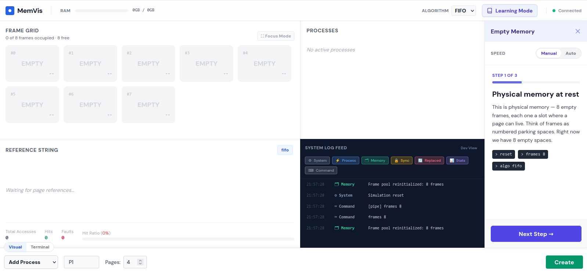
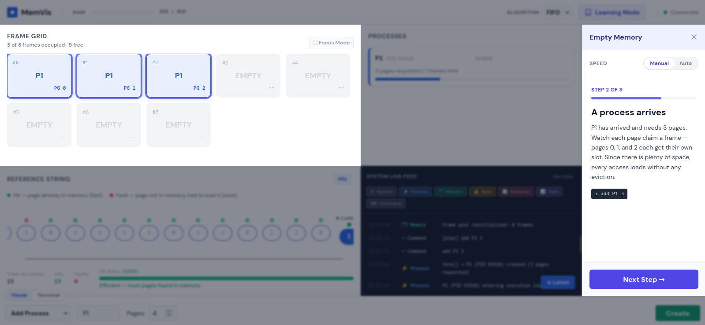

# Memory Allocation Visualizer


Memory Allocation Visualizer is a Linux-based educational system that demonstrates core operating-systems memory concepts through a live simulation and visualization stack. The backend runs as a real C program using forked child processes, shared memory, semaphores, pthreads, signals, and the `/proc` filesystem. A small Python bridge exposes the backend state over HTTP and Server-Sent Events, and a React frontend renders the live simulation.

The project was designed as a teaching aid for page replacement, process contention, synchronization, and demand paging. The UI is a viewer and control surface only; the backend remains the source of truth even if the frontend is closed.

## Documentation Sources

The project documentation in `docs/` describes the original proposal, the architecture, and the technical report that guided the implementation:

- [Project proposal](docs/MemoryVisualizer_Proposal.md)
- [Project report](docs/PROJECT_REPORT.md)
- [Technical report](docs/tech_report.md)

## Architecture

The repository is split into three cooperating layers:

### Backend

The backend is a C11 program located in `backend/`. It owns the shared memory segment, process lifecycle, synchronization, logging, and page replacement logic.

Key responsibilities:

- Create and manage simulated processes with `fork()`.
- Maintain a shared frame pool and process table.
- Coordinate access with named POSIX semaphores.
- Run a page replacement thread for FIFO, LRU, and OPT.
- Emit structured JSON state events to `/tmp/mem_state_pipe`.

### Bridge

The bridge is a Flask service in `bridge/`. It translates frontend requests into backend commands and streams backend state to the browser.

Key responsibilities:

- Accept POST requests from the UI and forward commands to `/tmp/mem_pipe`.
- Read newline-delimited JSON from `/tmp/mem_state_pipe`.
- Publish live updates to the frontend through SSE at `/stream`.
- Start and supervise the backend binary.

### Frontend

The frontend is a React + TypeScript application in `frontend/`. It renders the simulation state and provides controls for commands, learning scenarios, process management, and algorithm selection.

Key views:

- Frame grid for physical memory.
- Process list with live PID and RSS information.
- Reference string and hit/fault visualization.
- Structured log feed.
- Learning mode scenarios with contextual annotations.

## Core Concepts Demonstrated

This project demonstrates the following operating-systems topics in a working simulation:

- Process creation and termination with `fork()`, `SIGTERM`, and `SIGCHLD`
- Shared memory with System V IPC
- Synchronization with POSIX named semaphores
- Page replacement algorithms: FIFO, LRU, and OPT
- Live Linux memory inspection with `/proc/[pid]/statm` and `/proc/meminfo`
- Event-driven UI updates using Server-Sent Events

## Repository Layout

```text
.
├── backend/   # C backend and shared-memory simulation
├── bridge/    # Flask bridge between backend and frontend
├── docs/      # Proposal and report documents
└── frontend/  # React visualization client
```

## Prerequisites

You need the following tools on a Linux system:

- `gcc`
- `make`
- `python3`
- `pip`
- `node` and `npm`

Linux is required because the backend depends on `fork()`, named semaphores, System V shared memory, and `/proc`.

## Setup

### 1. Build the backend

```bash
cd backend
make
```

This produces the `memory_manager` binary in `backend/`.

### 2. Prepare the bridge environment

```bash
cd bridge
python3 -m venv .venv
source .venv/bin/activate
pip install -r requirements.txt
```

### 3. Install frontend dependencies

```bash
cd frontend
npm install
```

## Running the project

Start the bridge first. It launches the backend automatically when the binary is available.

### Terminal 1: Bridge and backend

```bash
cd bridge
source .venv/bin/activate
python3 bridge.py
```

The bridge serves the API on `http://localhost:5001`.

### Terminal 2: Frontend

```bash
cd frontend
npm run dev
```

The frontend runs on `http://localhost:5000` and proxies `/stream`, `/command`, and `/scenario` to the bridge.

## Default Runtime Behavior

- The backend starts with 8 frames and FIFO scheduling when launched by the bridge.
- The bridge creates and uses the named pipes `/tmp/mem_pipe` and `/tmp/mem_state_pipe`.
- The frontend connects to the bridge through SSE and reacts to live state changes.

## Common Commands

The command bar accepts the same syntax used by the backend CLI:

```text
add P1 3
kill P1
status
algo fifo
algo lru
algo opt
refs P1 1 2 3 4
frames 8
reset
exit
```

## Learning Mode


The frontend includes predefined scenarios for guided demonstrations:

- Empty memory
- Enough free memory
- Memory becomes full
- Page fault and replacement
- FIFO vs LRU comparison
- Thrashing

These scenarios are intended to show how the memory manager behaves under different workloads and replacement policies.

## Notes on Limits

The current implementation is sized for classroom use:

- Maximum frames: 32
- Maximum processes: 16
- Maximum reference string length per process: 64

## Troubleshooting

- If the bridge reports that the backend binary is missing, run `make` in `backend/` first.
- If the frontend cannot connect, confirm that the bridge is running on port 5001.
- If the simulation does not update, check that `/tmp/mem_pipe` and `/tmp/mem_state_pipe` exist and are writable.
- If stale semaphore or pipe state remains after a crash, restart the bridge so it recreates the runtime IPC resources.

## Project Status

The repository contains a complete simulation stack with live visualization, command control, and educational scenarios. The backend remains usable on its own from the terminal, while the frontend provides a structured view of the same state for demonstration and learning.
